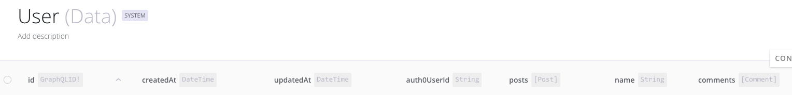
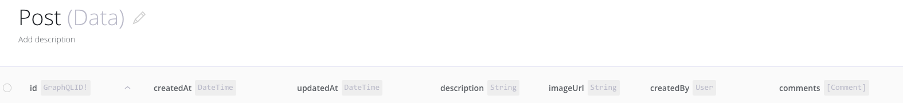
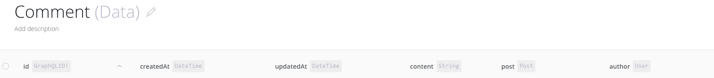
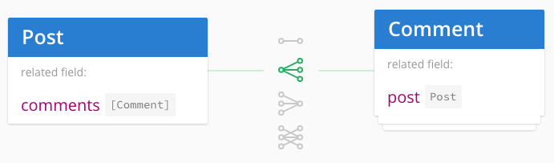
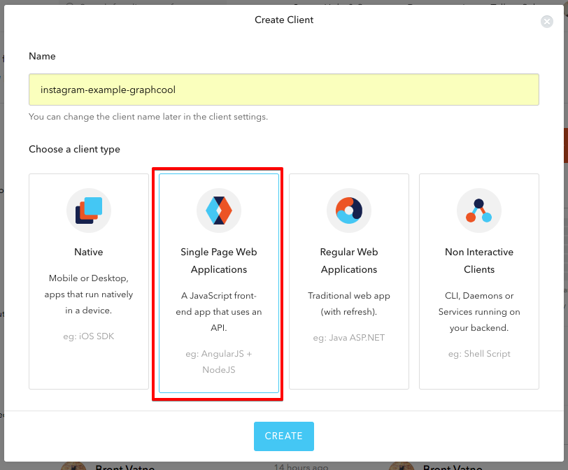
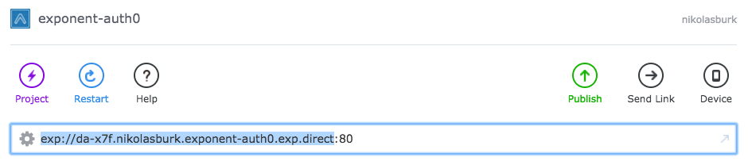

# exponent-auth0-instagram-example

This repository contains an Instagram clone using [**Exponent (React Native)**](https://docs.getexponent.com/versions/v14.0.0/index.html) and [**auth0**](https://auth0.com/) as an authentication provider. 


## Setup and Installation

### Creating the Graphcool project

In the [Graphcool console](https://console.graph.cool), create a new Graphcool project and call it `Instagram`


### Creating the Data Model

For creating the data model of your `Instagram` application, you have two different options:

1. Import a [schema file]() into Graphcool that contains all necessary information about the data model
2. Create the data model manually in the [Graphcool console](https://console.graph.cool)

In the following, we will explain both approaches, you can chose whichever you prefer. In any case, after you're done with the process, your _models_ should look as follows: 


 (note that the field `auth0userId` will only be added after we set up Auth0 as an _authentication provider_, so it's fine if you don't see that field in your `User` _model_ yet)
 





##### Import a Schema File (Option 1)

```graphql

type User {
	id: ID!
	createdAt: DateTime!
	updateAt: DateTime!
	posts: [Post]!
	name: String!
	comments: [Comment]!
}

type Post {
	id: ID!
	createdAt: DateTime!
	updatedAt: DateTime!
	description: String!
	imageUrl: String!
	createdBy: User!
	comments: [Comment]!
}

type Comment {
	id: ID!
	createdAt: DateTime!
	updatedAt: DateTime!
	content: String!
	post: Post!
	author: User!
}

```


##### Creating the Data Model manually (Option 2)

1. Create the following _models_ in the [Graphcool console](https://console.graph.cool):
	1. A _model_ called `Post` with _fields_ `description` and `imageUrl`, both of type `String`
	2. A _model_ called `Comment` with _field_ `content` of type `String`
2. Create the following _relations_:
	1. A _relation_ called `PostsByUser` that looks as follows:
		
	2. A _relation_ called `CommentsOnPost` that looks as follows:
	    
	3. A _relation_ called `CommentsOnPost` that looks as follows:
	    
	    
	    
### Setting up the Auth0 Authentication Provider

1. Navigate to [https://auth0.com/](https://auth0.com/), sign in and create a **New Client** of type **Single Page Web Applications** named `instagram-example-graphcool`
  	 
2. Open the info for the new client by clicking **Clients** in the left side-menu and selecting the `instagram-example-graphcool` client you just created, this page displays the `Domain`, `Client ID` and the `Client Secret` which you will need in a minute when setting up Auth0 in the Graphcool backend
3. Back in the [Graphcool console](https://console.graph.cool), enable Auth0 as an _authentication provider_ for the `Instagram` app:
	1. Click on **Integrations** in the left side-menu
	2. Select the **Auth0** integration
	3. Copy and paste the `Domain`, `Client Id` and `Client Secret` over from the Client info section in the Auth0 dashboard into the corresponding fields in the Auth0 integration popup and click **Enable**
  	 


### Connecting the Exponent app with Auth0

1. First clone this repository on your local machine and install the project dependencies 
 
	```
	git clone https://github.com/graphcool-examples/exponent-auth0-instagram-example.git
	cd exponent-auth0
	npm install # or yarn install
	```
2. Open `main.js` 
3. Set the variable `auth0_client_id` by completely replacing the current value of the variable with your `Client Id` from before 
4. Set the variable `authorize_url` by only replacing the part `<Domain>` with your `Domain` from before (it will then look similar to: `https://johndoe.eu.auth0.com/authorize`)
5. Set the variable `graphQL_endpoint` by replacing `<Graphcool Project Id>` with the Project Id of the `Instagram` project which you find in the [Graphcool console](https://console.graph.cool) if you select the `Instagram` project in the left side-menu and then navigate to **Settings --> General** (it will then look similar to: `https://api.graph.cool/simple/v1/ciyzv01u06cq60185dno8c7nu`)
6. Finally, we need to configure the Auth0 redirect flow with the exponent app in order to set the last variable which is the `redirect_uri`:
   1. If you haven't done so already, download the [Exponent development environment](https://docs.getexponent.com/versions/v14.0.0/introduction/installation.html) (**XDE**) open it and sign in
   2. Open this project by clicking **Project** on the top-left and selecting the directory `exponent-auth0` (note that this is **not** the _root directory_ of this repository which is called `exponent-auth0-instagram-example`)
   3. Now, from the exponent URL that you see in the address bar on top, copy everything **except for the colon and port** as shown in this screenshot:
  	 
  	4. Again, in `main.js`, set the `redirect_uri` variable by replacing the part `<Exponent URL without Port>` with the value you just copied; note that you need to do this in the first part of the `if`-clause - the `else`-part is for the case where the app has been published, then Exponent will set the variable for you 
  	5. Lastly, back on the config page of the `instagram-example-graphcool` client on the [Auth0 website](https://manage.auth0.com/#/clients) copy the _full value_ of `redirect_uri` from `main.js` into the field **Allowed Callback URLs** (it will look similar to `exp://da-x7f.johndoe.exponent-auth0.exp.direct/+/redirect`)
  	6. Make sure to click **Save Changes** on the bottom of the page


## Running the App 🚀

You can now go ahead and run the app by using the **Send Link** option in XDE. This will send a link to an email address of your choice - if you then open the link on a smartphone, the app will be started. Note that **Auth0 authentication with Exponent currently only works when running the app on a _real device_ !!** 

If you'd like to know more about how the Auth0 flow works with Exponent from a technical perspective, you can refer to [this example](https://github.com/AppAndFlow/exponent-auth0-example).


## Publishing the App

If you want to make your app accessible to other Exponent users, or even publish it on the App Store, you will need to add another url to the field **Allowed Callback URLs** in the **config page** of your Auth0 client on the [Auth0 website](https://manage.auth0.com/#/clients). This URL looks as follows: `https://exp.host/<Your Exponent Username>/<Your Exponent App>/+/redirect`.


## Help & Community [](https://slack.graph.cool)

Join our [Slack community](http://slack.graph.cool/) if you run into issues or have questions. We love talking to you!


